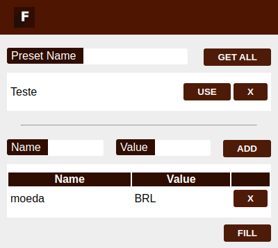

# Field Filler (Google Chrome Extension)
A simple chrome extension to fill form values by input name

# how to test in your chrome
* clone or the repository
* In your chrome Extension Manager (`chrome://extensions/`), enable `Developer Mode`
* Load Extension folder

# how to save preset
* Open the base page
* Fill the inputs
* Fill the field *Preset Name* and click *Get All*

# How to Add other field names on Preset
* Fill the name of input,  value and click in **ADD**

# how to apply
* open or refresh the page
* Click **Fill**

